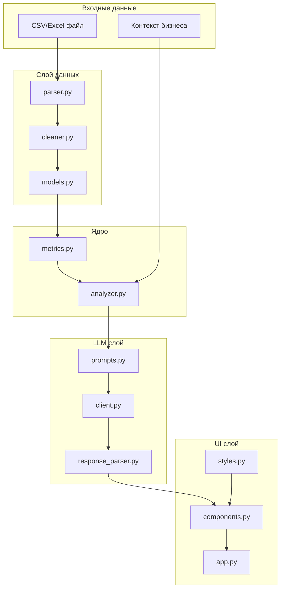

# План реализации FinRentgen Wave 1

**Overview:** Поэтапная реализация Ultra-MVP финансового анализатора согласно RFC. Каждый этап — логически завершённый блок, который можно протестировать отдельно.

---

## Архитектура



---

## Этапы реализации

### Этап 1: Фундамент (config + models)

Базовые модули, от которых зависят все остальные.

| Файл | Описание |
|------|----------|
| `config.py` | Конфигурация через pydantic-settings, загрузка из .env |
| `data/models.py` | Pydantic-модели: PnLRow, PnLData, CalculatedMetrics, Insight, AnalysisResult |

**Проверка:** импорт моделей без ошибок, валидация тестовых данных.

- [ ] config.py
- [ ] data/models.py

---

### Этап 2: Парсинг данных (parser + cleaner)

Чтение файлов и очистка грязных данных.

| Файл | Описание |
|------|----------|
| `data/parser.py` | Чтение CSV/Excel, определение формата, первый лист для Excel |
| `data/cleaner.py` | Нормализация колонок, очистка чисел ("1 200 000" -> 1200000), парсинг дат |

**Проверка:** успешный парсинг `examples/sample_pnl_clean.csv` и `examples/sample_pnl_dirty.csv`.

- [ ] data/parser.py
- [ ] data/cleaner.py

---

### Этап 3: Расчёт метрик (metrics)

Локальный расчёт всех финансовых показателей.

| Файл | Описание |
|------|----------|
| `core/metrics.py` | Средние, тренды, доли расходов, детекция аномалий |

**Проверка:** корректные метрики на тестовых данных, тренд "insufficient_data" при <6 периодах.

- [ ] core/metrics.py

---

### Этап 4: LLM интеграция (prompts + client + response_parser)

AI-агностичный слой для работы с LLM.

| Файл | Описание |
|------|----------|
| `llm/prompts.py` | SYSTEM_PROMPT и ANALYSIS_PROMPT |
| `llm/client.py` | Абстрактный протокол LLMClient + OpenAIClient с retry |
| `llm/response_parser.py` | Извлечение JSON, repair, парсинг инсайтов |

**AI-агностичность:** базовый Protocol, OpenAI — первая реализация. В Wave 2 добавляются YandexGPT/GigaChat без изменения остального кода.

**Проверка:** успешный запрос к OpenAI, корректный парсинг JSON-ответа.

- [ ] llm/prompts.py
- [ ] llm/client.py
- [ ] llm/response_parser.py

---

### Этап 5: Оркестрация (analyzer)

Связывание всех компонентов в единый пайплайн.

| Файл | Описание |
|------|----------|
| `core/analyzer.py` | analyze_file(): парсинг -> очистка -> метрики -> LLM -> результат |

**Проверка:** полный цикл анализа файла возвращает AnalysisResult.

- [ ] core/analyzer.py

---

### Этап 6: UI (styles + components + app)

Gradio-интерфейс с кастомными стилями.

| Файл | Описание |
|------|----------|
| `ui/styles.py` | CSS: цвета, карточки инсайтов |
| `ui/components.py` | Gradio Blocks: загрузка файла, метрики, инсайты |
| `app.py` | Точка входа, запуск на порту 7860 |

**Проверка:** UI запускается, файл загружается, результаты отображаются.

- [ ] ui/styles.py
- [ ] ui/components.py
- [ ] app.py

---

### Этап 7: Логирование + финализация

| Задача | Описание |
|--------|----------|
| Логирование | Добавить logging во все модули (особенно LLM запросы/ответы) |
| Обработка ошибок | Понятные сообщения для пользователя |
| README | Инструкция по запуску |
| Тестирование | Ручная проверка на обоих примерах |

- [ ] Логирование
- [ ] README.md
- [ ] Финальное тестирование

---

## Зависимости этапов

```
Этап 1 ─┬─> Этап 2 ──> Этап 3 ─┬─> Этап 5 ──> Этап 6 ──> Этап 7
        │                      │
        └─> Этап 4 ────────────┘
```

Каждый этап завершается коммитом в git.

