# План реализации FinRentgen Wave 1

**Overview:** Поэтапная реализация Ultra-MVP финансового анализатора согласно RFC. Каждый этап — логически завершённый блок, который можно протестировать отдельно.

---

## Архитектура

```mermaid
flowchart TB
    subgraph input [Входные данные]
        File[CSV/Excel файл]
        Context[Контекст бизнеса]
    end
    
    subgraph data_layer [Слой данных]
        Parser[parser.py]
        Cleaner[cleaner.py]
        Models[models.py]
    end
    
    subgraph core_layer [Ядро]
        Metrics[metrics.py]
        Analyzer[analyzer.py]
    end
    
    subgraph llm_layer [LLM слой]
        Prompts[prompts.py]
        Client[client.py]
        ResponseParser[response_parser.py]
    end
    
    subgraph ui_layer [UI слой]
        Styles[styles.py]
        Components[components.py]
        App[app.py]
    end
    
    File --> Parser
    Parser --> Cleaner
    Cleaner --> Models
    Models --> Metrics
    Metrics --> Analyzer
    Context --> Analyzer
    Analyzer --> Prompts
    Prompts --> Client
    Client --> ResponseParser
    ResponseParser --> Components
    Styles --> Components
    Components --> App
```



---

## Этапы реализации

### Этап 1: Фундамент (config + models)

Базовые модули, от которых зависят все остальные.

| Файл | Описание |
|------|----------|
| `config.py` | Конфигурация через pydantic-settings |
| `.env.example` | Шаблон переменных окружения |
| `data/__init__.py` | Экспорт моделей |
| `data/models.py` | Pydantic-модели: PnLRow, PnLData, CalculatedMetrics, Insight, AnalysisResult |

**Проверка:** 
- Импорт `from data.models import PnLRow` без ошибок
- Валидация: `PnLRow(period=date(2024,1,1), revenue=100000)` создаётся успешно
- Валидация: `PnLRow(period=date(2024,1,1), revenue=-100)` выбрасывает ValidationError

- [x] config.py
- [x] .env.example
- [x] data/__init__.py
- [x] data/models.py

---

### Этап 2: Парсинг данных (parser + cleaner)

Чтение файлов и очистка грязных данных.

| Файл | Описание |
|------|----------|
| `data/parser.py` | Чтение CSV/Excel, определение формата, первый лист для Excel |
| `data/cleaner.py` | Нормализация колонок, очистка чисел ("1 200 000" -> 1200000), парсинг дат |
| `examples/sample_pnl_clean.csv` | Чистые тестовые данные (6 периодов) |
| `examples/sample_pnl_dirty.csv` | Грязные тестовые данные (пробелы, "—", "нет", строка "Итого") |

**Проверка на sample_pnl_clean.csv:**
- Парсится без warnings
- 6 строк данных
- revenue первой строки = 850000

**Проверка на sample_pnl_dirty.csv:**
- Парсится с warnings: "Удалено X строк без выручки", "Нераспознанные колонки"
- Строка "Итого" удалена
- "1 200 000" преобразовано в 1200000.0
- "—" и "нет" преобразованы в None

- [x] data/parser.py
- [x] data/cleaner.py
- [x] examples/sample_pnl_clean.csv (уже есть)
- [x] examples/sample_pnl_dirty.csv (уже есть)

---

### Этап 3: Расчёт метрик (metrics)

Локальный расчёт всех финансовых показателей.

| Файл | Описание |
|------|----------|
| `core/__init__.py` | Экспорт функций |
| `core/metrics.py` | Средние, тренды, доли расходов, детекция аномалий |

**Проверка на sample_pnl_clean.csv:**
- `avg_revenue` = 876667 (округлено)
- `avg_operating_margin_pct` ≈ 12.5%
- `revenue_trend_direction` = "growing" (+6.3%, т.к. 6 периодов достаточно для тренда)
- `anomalies` = [] (нет скачков >30% в данных)

**Проверка на sample_pnl_dirty.csv:**
- После очистки: 5 валидных периодов
- `revenue_trend_direction` = "insufficient_data"

- [x] core/__init__.py
- [x] core/metrics.py

---

### Этап 4: LLM интеграция (prompts + client + response_parser)

AI-агностичный слой для работы с LLM.

| Файл | Описание |
|------|----------|
| `llm/__init__.py` | Фабрика `get_llm_client()` для получения клиента |
| `llm/prompts.py` | SYSTEM_PROMPT и ANALYSIS_PROMPT |
| `llm/client.py` | Protocol `LLMClient` + класс `OpenAIClient` с retry |
| `llm/response_parser.py` | Извлечение JSON, repair, парсинг инсайтов |

**AI-агностичность:** 
- `LLMClient` — абстрактный Protocol с методом `complete()`
- `OpenAIClient` — первая реализация
- `get_llm_client()` — фабрика, возвращает клиент по настройкам
- В Wave 2: добавить `YandexGPTClient`, `GigaChatClient` без изменения остального кода

**Проверка:**
- `from llm import get_llm_client` работает
- JSON repair: `'{"a": 1,}'` → `{"a": 1}`
- JSON repair: ``` ```json\n{"a":1}\n``` ``` → `{"a": 1}`
- `parse_insights()` возвращает список `Insight` из валидного JSON

- [x] llm/__init__.py
- [x] llm/prompts.py
- [x] llm/client.py
- [x] llm/response_parser.py

---

### Этап 5: Оркестрация (analyzer)

Связывание всех компонентов в единый пайплайн.

| Файл | Описание |
|------|----------|
| `core/analyzer.py` | `analyze_file()`: парсинг → очистка → метрики → LLM → результат |

**Проверка:**
- `analyze_file("examples/sample_pnl_clean.csv")` возвращает `AnalysisResult`
- `result.metrics.avg_revenue` = 876667
- `result.insights` содержит 3-5 элементов типа `Insight`
- `result.parsing_warnings` — список (может быть пустой для clean.csv)

- [x] core/analyzer.py

---

### Этап 6: UI (styles → components → app)

Gradio-интерфейс с кастомными стилями.

**Порядок важен:** styles.py → components.py → app.py (каждый следующий импортирует предыдущий)

| Файл | Описание |
|------|----------|
| `ui/__init__.py` | Экспорт компонентов |
| `ui/styles.py` | CSS: цвета, карточки инсайтов (🔴🟡🟢) |
| `ui/components.py` | Gradio Blocks: загрузка файла, метрики, инсайты |
| `app.py` | Точка входа, запуск на порту 7860 |

**Проверка:**
- `python app.py` запускает сервер на http://localhost:7860
- Загрузка sample_pnl_clean.csv показывает метрики и инсайты
- Загрузка sample_pnl_dirty.csv показывает warnings "Мы исправили данные"
- Инсайты отображаются с цветовой кодировкой (problem=🔴, observation=🟡, opportunity=🟢)

- [x] ui/__init__.py
- [x] ui/styles.py (первый!)
- [x] ui/components.py (второй)
- [x] app.py (третий)

---

### Этап 7: Финализация

| Файл/Задача | Описание |
|-------------|----------|
| `requirements.txt` | Проверить/дополнить зависимости |
| Логирование | Добавить `logging` во все модули (особенно LLM запросы/ответы) |
| `README.md` | Инструкция по запуску |
| Тестирование | Ручная проверка полного цикла |

**Проверка логирования:**
- При запросе к LLM в консоль выводится: промпт (укороченный), время запроса, размер ответа
- При ошибке парсинга JSON — полный ответ LLM в логах

**Проверка README:**
- Содержит: установка зависимостей, создание .env, запуск, примеры использования

- [x] requirements.txt (проверен)
- [x] Логирование (в app.py)
- [x] README.md
- [ ] Финальное тестирование

---

## Зависимости этапов

```
Этап 1 ─┬─> Этап 2 ──> Этап 3 ─┬─> Этап 5 ──> Этап 6 ──> Этап 7
        │                      │
        └─> Этап 4 ────────────┘
```

Каждый этап завершается коммитом в git.

---

## Текущий статус

| Этап | Статус |
|------|--------|
| 1. Фундамент | ✅ Готово |
| 2. Парсинг | ✅ Готово |
| 3. Метрики | ✅ Готово |
| 4. LLM | ✅ Готово |
| 5. Оркестрация | ✅ Готово |
| 6. UI | ✅ Готово |
| 7. Финализация | 🔄 В процессе |
